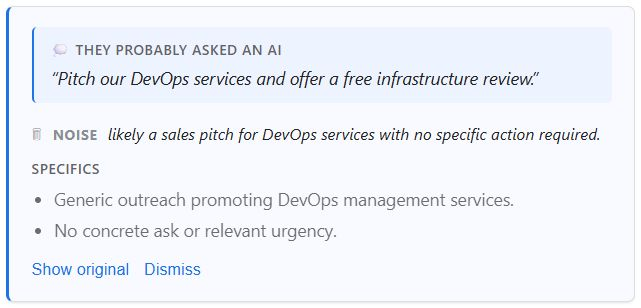

<div align="center">


# Defluff

**AI wrote this email. Let's see what they actually wanted.**

Reverse the AI behind corporate email: infer the prompt the sender gave their LLM,
classify the message, surface the real ask. Zero servers, your keys, your models.

[](https://github.com/FinAegis/defluff/actions/workflows/ci.yml)
[](LICENSE)
[](SECURITY.md)
[](#providers)

<br>



<sub>A real sales-outreach email, defluffed — the reversed prompt gives it away in one line.</sub>

</div>

---

## What is this?

Corporate email has become unreadable. Half of every message is AI-generated filler, restated context, and *"I hope this finds you well."*

Defluff is a browser extension and Outlook add-in that replaces the body of an open email with:

1. **Authorship** — AI-written, AI-polished, or plainly human. No more always-on "they probably asked an AI" on messages that were clearly written by hand.
2. **The reversed prompt** — one line naming what the sender probably asked an AI to write ("Pitch our DevOps services and offer a free infrastructure review"). Only shown when AI was actually involved. Often this is all you need.
3. **A verdict** — Actionable / Response needed / FYI / Noise, with scam-pattern naming for the threats you actually see in 2026: invoice fraud / BEC, phishing, fake recruiter, conference scam, crypto pitch.
4. **3–5 bullets** — the actual specifics, preserved verbatim. Returned in the email's own language — French email gets French bullets, German gets German.

*"Show original"* is one click away if you want the full email back.

The interesting part isn't the summarization — that's just an LLM call with a restrictive prompt. The interesting part is the **trust model**: there is no Defluff backend. Your email body and your API key never leave your browser for any infrastructure we operate. Each De-Fluff click goes straight from your browser to the LLM provider you picked. Zero retention isn't a policy, it's the architecture.

---

## How it works

<table>
<tr>
<td align="center" width="33%">

**1. Install**

Chrome/Edge/Firefox extension,
or Outlook Office.js add-in.

</td>
<td align="center" width="33%">

**2. Configure**

Click the icon, pick a provider,
paste your key. That's it.

</td>
<td align="center" width="33%">

**3. Defluff**

Click the button on any email.
Prose collapses into bullets.

</td>
</tr>
</table>

---

## Install

### Available now

<table>
<tr>
<td>

**[Claude Code plugin](apps/claude-skill#readme)** — Anthropic agent surface

</td>
<td>

```bash
claude plugin marketplace add FinAegis/defluff
claude plugin install defluff@finaegis
```

</td>
</tr>
<tr>
<td>

**[ClawHub](https://clawhub.ai/yozaz/defluff)** — Openclaw skill

</td>
<td>

```bash
openclaw skills install defluff
```

</td>
</tr>
</table>

### Coming soon (pending live-testing — track in [#7](https://github.com/FinAegis/defluff/issues/7))

- Chrome Web Store — browser extension for Gmail / Outlook Web / LinkedIn Messaging
- Edge Add-ons — same build
- Firefox AMO — same build
- Microsoft AppSource — Outlook add-in (desktop + web)

### For developers right now

```bash
git clone https://github.com/FinAegis/defluff.git
cd defluff
pnpm install
pnpm --filter @defluff/extension build
```

Then load `apps/extension/dist` as an unpacked extension (`chrome://extensions` → Developer mode → **Load unpacked**). Click the Defluff icon in the toolbar to open settings.

For the Outlook add-in:

```bash
pnpm --filter @defluff/outlook-addin dev
```

Then sideload `apps/outlook-addin/manifest.xml` from **Outlook Web → Get Add-ins → My add-ins → Custom Addins**.

---

## Providers

| Provider | Default model | How it connects |
|---|---|---|
| **Anthropic Claude** | `claude-opus-4-7` | Messages API with the browser-direct header |
| **OpenAI** | `gpt-5.4` | Chat Completions with `max_completion_tokens` — works on the reasoning models (o-series / GPT-5) and older chat models alike |
| **Google Gemini** | `gemini-2.5-pro` | Key as query param, native CORS. (Preview tier `gemini-3.1-pro-preview` available via model override.) |
| **OpenAI-compatible** | `llama3` | Ollama, LM Studio, LiteLLM, or any OpenAI-compatible endpoint. [Setup ↓](#running-against-a-local-model) |

All four share one extraction prompt. Swap providers anytime from the options page.

**A note on the defaults.** Defluff defaults to each provider's current frontier model rather than a mini/haiku/flash tier. Scam detection and AI-authorship classification are judgment tasks — smaller models regress meaningfully (they mark obvious AI-recruiter pitches as "legit" because they lean literal). A typical email is ~500-1500 input tokens + ~200 output, so per-click cost lands in the ~$0.01-0.05 range. If that's too much for your usage pattern, override the model to a cheaper tier (`claude-haiku-4-5`, `gpt-4o-mini`, `gemini-2.5-flash`) from the options page — the prompt still handles them, just with less aggression on edge cases.

### Running against a local model

Point Defluff at an Ollama or LM Studio instance and get zero per-call cost, full privacy, and no rate limits:

1. **Install and run Ollama.** `brew install ollama` (or equivalent) then `ollama pull llama3` and `ollama serve`.
2. **Allow the extension origin to call Ollama.** Ollama's default CORS config blocks browser requests. Start Ollama with:

   ```bash
   OLLAMA_ORIGINS='chrome-extension://*,moz-extension://*' ollama serve
   ```

   Or the more permissive `OLLAMA_ORIGINS='*'` if you're not fussy. On macOS with the Ollama app, `launchctl setenv OLLAMA_ORIGINS '*'` then restart the app.
3. **Configure Defluff.** Options page → Provider: **OpenAI-compatible** → Base URL: `http://localhost:11434/v1` → Model: `llama3` (or whatever you pulled) → leave API key blank → Save.

LM Studio is similar: start its local server, point the base URL at `http://localhost:1234/v1`. LiteLLM and other OpenAI-compatible gateways work the same way.

---

## How it compares

|   | **Defluff** | Shortwave | Superhuman AI | Grammarly |
|---|---|---|---|---|
| Your email reaches their servers | **Never** | Yes | Yes | Yes |
| Stores your content | **Never** | Yes | Yes | Yes |
| Needs an account | **No** | Yes | Yes | Yes |
| Monthly cost | **$0\*** | $12 | $40 | $12 |
| Open source | **Yes** | No | No | No |
| Works with local LLMs | **Yes (Ollama)** | No | No | No |

<sub>* Plus whatever you pay your chosen LLM provider. Typical heavy usage: under $1/month on Claude Haiku or GPT-4o mini. $0 on Ollama.</sub>

---

## Privacy

- Your email never touches FinAegis infrastructure. **There is no FinAegis infrastructure.**
- API keys are stored in `chrome.storage.sync` (browser) or `Office.context.roamingSettings` (Outlook) — encrypted at rest, per-user, synced by the platform.
- Extension permissions are host-scoped: `mail.google.com`, `outlook.office.com`, and the exact LLM endpoints you'll use. **Never `<all_urls>`.**
- Zero analytics, zero telemetry, zero accounts.

Full threat model: **[SECURITY.md](SECURITY.md)**. Reporting: private advisories via [GitHub Security](https://github.com/FinAegis/defluff/security/advisories/new).

---

## Architecture

```
  your browser / Outlook webview
  ─────────────────────────────────────────────────
  [De-Fluff button] ──► [email text] ──► [LLM provider]
                                              ↑
                                 api.anthropic.com /
                                 api.openai.com /
                                 generativelanguage.googleapis.com /
                                 your-ollama-endpoint
```

A pnpm monorepo. TypeScript end to end. Vite for bundling.

| Package | What it is |
|---|---|
| [`packages/core`](packages/core) | Extraction prompt, 4 provider adapters, bullet parser, typed errors. Pure TS, no platform APIs. |
| [`apps/extension`](apps/extension) | MV3 extension for Chrome/Edge/Firefox. React options page, Shadow-DOM-hosted content UI so host-page CSS can't bleed in. |
| [`apps/outlook-addin`](apps/outlook-addin) | Office.js add-in. Plain-TS task pane, zero runtime deps. |
| [`apps/claude-skill`](apps/claude-skill) | Claude Code plugin (`SKILL.md` + manifest). Distributed via the [FinAegis marketplace](.claude-plugin/marketplace.json) at the repo root — `/plugin install defluff@finaegis`. |
| [`apps/openclaw-skill`](apps/openclaw-skill) | A single `SKILL.md` (markdown + YAML) for the [Openclaw](https://openclaw.ai) agent platform — published to [ClawHub](https://clawhub.ai/yozaz/defluff). |

Provider adapters use plain `fetch()` — no SDKs in the bundle — to keep client bundles small and the audit surface minimal.

---

## Contributing

See **[CONTRIBUTING.md](CONTRIBUTING.md)** for setup, the architectural constraints that are non-negotiable (no backend, host-scoped permissions, verbatim extraction prompt), and commit conventions.

The most useful contributions right now are the [**launch-blocker issues**](https://github.com/FinAegis/defluff/labels/launch-blocker) — real-world Gmail/Outlook DOM validation and a CORS smoke test against each provider from a live Outlook task pane.

---

## License & support

[MIT](LICENSE). Free, forever. Fork it, audit it, ship your own.

If Defluff saves you an hour a week and you'd like to say thanks: [☕ buymeacoffee.com/finaegis](https://buymeacoffee.com/finaegis). Entirely optional — the product is and always will be free.

<sub>Built with skepticism by [FinAegis](https://github.com/FinAegis).</sub>
